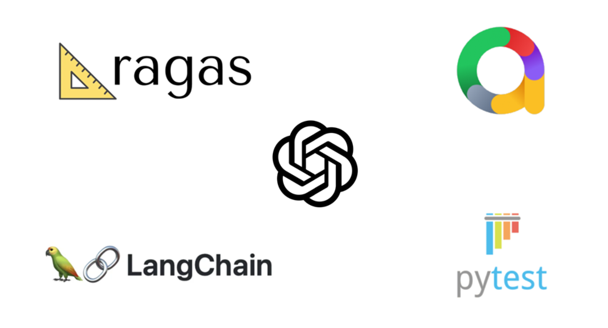

# 📘 ragas-openai-pytest-llm-evaluator

A powerful **Pytest-based evaluation framework** for analyzing Retrieval-Augmented Generation (RAG) pipelines and Large Language Models (LLMs).  
This tool enables robust testing of **retrieval**, **augmentation**, and **generation** stages using industry-leading metrics from **RAGAS**, **LangChain**, and **OpenAI**.

---

# 📑 Contents
1. [Overview](#overview)
2. [Features](#features)
3. [Tech Stack](#tech-stack)
4. [Evaluation Metrics](#evaluation-metrics)
5. [Dataset Generation](#dataset-generation)
6. [Repository Structure](#repository-structure)
7. [Execution Commands](#execution-commands)
8. [SonarQube Integration](#sonarqube-integration)
9. [Jenkins Pipeline (CI/CD)](#jenkins-pipeline-cicd)

---

# 💡 Overview

This framework allows developers and researchers to perform **end-to-end evaluation** of RAG-based pipelines, ensuring quality across the following stages:

- **Retrieval Evaluation**
- **Augmentation Evaluation**
- **Generation Evaluation**

It integrates seamlessly with:

- **RAGAS** — Metric evaluation  
- **LangChain** — LLM orchestration  
- **OpenAI** — Model execution  
- **Allure** — Test reporting  

### 📊 RAG Evaluation Flow



---

# 🚀 Features

### 1️⃣ Multi-Stage Testing  
Evaluate retrieval, augmentation, and generation independently.

### 2️⃣ Rich Metric Coverage  
Includes all major RAGAS **singleton** and **multi-turn** metrics.

### 3️⃣ Multi-Turn Conversation Support  
Evaluate consistency, context retention, and topic adherence.

### 4️⃣ Synthetic Dataset Generation  
Generate both **single-turn** and **multi-turn** datasets easily.

### 5️⃣ CI/CD Friendly  
Supports **SonarQube** code quality and **Jenkins** automation.

---

# ⚙️ Tech Stack

| Component | Purpose |
|----------|---------|
| **Python** | Core implementation |
| **Pytest** | Test execution |
| **LangChain** | LLM orchestration |
| **OpenAI** | Model integration |
| **RAGAS Library** | Evaluation metrics |
| **Allure** | Test reporting |

---

# 📊 Evaluation Metrics

## 🔹 Single-turn Metrics
- Faithfulness  
- Context Precision  
- Context Recall  
- Answer Relevancy  
- Factual Correctness  
- Rubric Score  

## 🔸 Multi-Turn Metrics
- Aspect Critic  
- Topic Adherence Score  
- Rubric Score  
- Conversational Memory Score  

---

# 🧪 Dataset Generation

Supports creation of structured datasets for evaluation:

### **1. Single-Turn Dataset**
- Q/A pairs  
- Ground truth  
- Knowledge chunks  

### **2. Multi-Turn Dataset**
- Conversation flows  
- Follow-up questions  
- Context evolution  

---
# ✅ How to Use

## 1. Clone the Repository

``` bash
git clone <your-repo-url>
cd ragas-openai-pytest
```

## 2. Configure Environment

Update the `.env` file:

    Update OPENAI_API_KEY, LANGCHAIN_API_KEY, SMTP_HOST, SMTP_PORT_NUMBER, EMAIL_SENDER, EMAIL_RECEIVER Details

## 3. Install Dependencies

``` bash
pip install -r requirements.txt
```

## 4. Run Tests

Run all evaluation tests: pytest

``` bash
pytest
```

Generate Allure test report:

``` bash
pytest --alluredir=reports/
```

# 📂 Repository Structure
```
ragas-openai-pytest/
│
├── tests/                     # All pytest test cases
│   ├── test_loyalty_tier_offers.py   # Singleton RAGAS tests
│   ├── test_rest_assured.py          # Multi-turn tests
│   └── __init__.py
│
├── llm-base/                  # Core logic for dataset generation & evaluation
│   ├── ragas_dataset_generator.py    # Create single-turn & multi-turn datasets
│   ├── ragas_metrics_evaluator.py    # Evaluate various RAG metrics
│
├── utilities/                 # Helper utilities
│   ├── assertions.py
│   ├── email_reporter.py
│   ├── ironman.py
│   ├── logger.py
│   └── __init__.py
│
├── generate-datasets/
│   ├── generate_dataset.py           # Script to create datasets
│
├── dataset/                   # Pre-generated datasets
│   ├── loyalty-tier-offers/
│   │   ├── singleturn_dataset.json
│   │   └── multiturn_dataset.json
│   ├── rest_assured/
│   │   ├── singleturn_dataset.json
│   │   └── multiturn_dataset.json
│
├── feature_documents/         # Source documents for RAG
│   ├── loyalty-tier-offers/
│   ├── rest_assured/
│
├── configs/                   # Configurations for LLM/RAG
│   ├── openai_config.yaml
│   ├── rag_pipeline.yaml
│   └── environment.yaml
│
├── utilities/                 # Non-code assets
│   ├── images/
│   │   └── img.png            # Diagram used in README
│   └── logs/                  # Log files (optional)
│
├── requirements.txt           # Project dependencies
├── conftest.py
├── .jenkins                   # Jenkins pipeline configs
├── sonar-project.properties   # SonarQube configuration
├── README.md                  # Project documentation
└── .gitignore
```